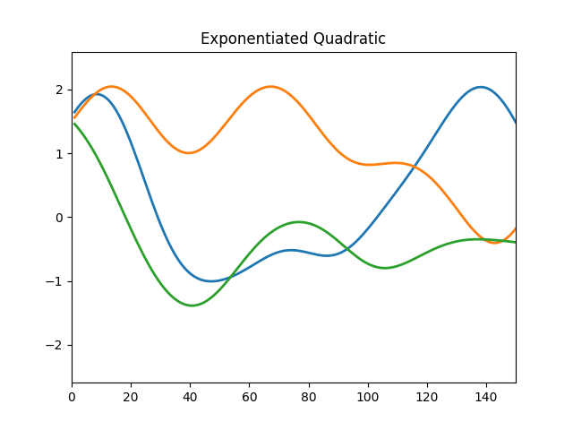
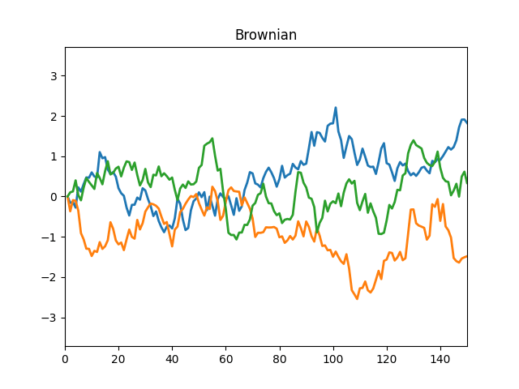
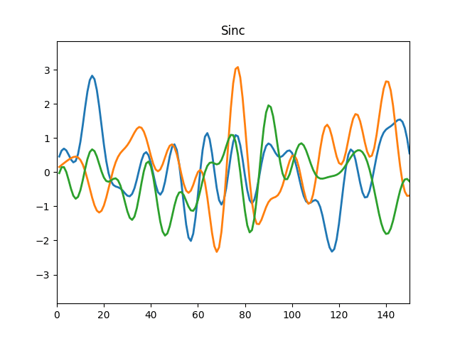
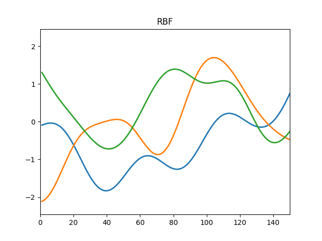
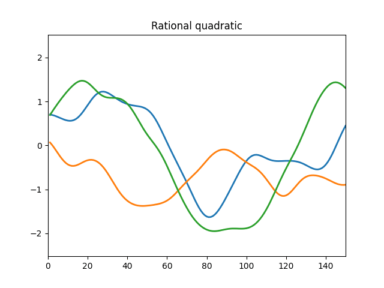

# Animating Samples from Gaussian Distributions

The animation below are samples from gaussians with different kernels.








## Live Demo

Go to [heroku app](https://gpkernels.herokuapp.com) to see a live demo.

## How to implement?


## Citation

```bibtex
@TechReport{hennig-tr-is-8,
author = {Philipp Hennig},
title = {Animating Samples from Gaussian Distributions},
institution = {Max Planck Institute for Intelligent Systems},
year = 2013,
type = {Technical Report},
number = 8,
address = {Spemannstra{\ss}e, 72076 T{\"u}bingen, Germany},
month = {September}
}
```
